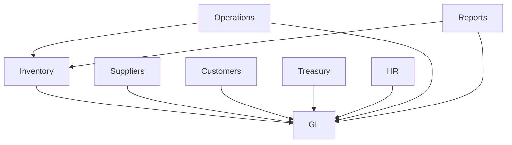

# 🤖 AGENT EXECUTION PROMPT - System Audit

**MISSION**: Comprehensive system audit to identify unused tables, dead code, and module relationships

**AUTHORITY**: FULL READ ACCESS - Audit only, no modifications yet

**TIMELINE**: 3-4 hours

**DELIVERABLES**: 5 detailed reports

---

## 🎯 YOUR TASK

You are conducting a **complete system audit** of the Agri-Nile Flow application.

### What You Will Do:

1. ✅ **Audit Database** - Query D1 to analyze all tables
2. ✅ **Audit Code** - Scan all TypeScript files to find dead code
3. ✅ **Map Integrations** - Document how modules interact
4. ✅ **Create Reports** - 5 comprehensive markdown reports
5. ✅ **Create Cleanup Script** - SQL script to remove unused tables (don't execute yet)

---

## 📦 PHASE 1: DATABASE AUDIT (60 min)

### Step 1.1: List All Tables
```sql
-- Query D1 database
SELECT name, type 
FROM sqlite_master 
WHERE type='table' 
ORDER BY name;
```

### Step 1.2: For Each Table, Get:
```sql
-- Row count
SELECT COUNT(*) as row_count FROM [table_name];

-- Schema
PRAGMA table_info([table_name]);

-- Indexes
PRAGMA index_list([table_name]);

-- Foreign keys
PRAGMA foreign_key_list([table_name]);
```

### Step 1.3: Categorize Each Table

**Categories:**
- **ACTIVE** - Has data (rows > 0) AND referenced in code
- **EMPTY** - No data (rows = 0)
- **DEPRECATED** - Marked for removal (e.g., gl_account_mappings)
- **ORPHAN** - No foreign keys, not referenced in code
- **REDUNDANT** - Duplicate functionality

### Step 1.4: Create Report

**Output**: `DATABASE_AUDIT_REPORT.md`

**Format**:
```markdown
# Database Audit Report
Date: 2026-04-27

## Executive Summary
- Total Tables: X
- Active Tables: X
- Empty Tables: X
- Deprecated Tables: X
- Orphan Tables: X
- Redundant Tables: X

## Detailed Analysis

### Active Tables (KEEP)
| Table | Rows | Module | Purpose | Referenced In |
|-------|------|--------|---------|---------------|
| journal_entries | 955 | GL | Core ledger | src/lib/gl.ts, src/api/gl.ts |
| ... | ... | ... | ... | ... |

### Empty Tables (REVIEW)
| Table | Rows | Last Used | Recommendation |
|-------|------|-----------|----------------|
| old_inventory_log | 0 | Never | DELETE |
| ... | ... | ... | ... |

### Deprecated Tables (PHASE OUT)
| Table | Rows | Replaced By | Action |
|-------|------|-------------|--------|
| gl_account_mappings | 19 | posting_engine | Mark deprecated, keep for history |
| ... | ... | ... | ... |

### Orphan Tables (DELETE)
| Table | Rows | Reason | Action |
|-------|------|--------|--------|
| temp_migration_backup | 0 | Migration artifact | DELETE |
| ... | ... | ... | ... |

### Redundant Tables (CONSOLIDATE)
| Table | Duplicate Of | Action |
|-------|--------------|--------|
| ... | ... | ... |

## Foreign Key Relationships
(Mermaid diagram showing all FK relationships)

## Recommendations
1. DELETE: [list tables]
2. DEPRECATE: [list tables]
3. KEEP: [list tables]
```

---

## 📦 PHASE 2: CODE AUDIT (60 min)

### Step 2.1: Scan Backend Files
```bash
# Find all TypeScript files
find src/ -name "*.ts" -type f
```

### Step 2.2: For Each File, Extract:
- Imports
- Exported functions
- Database queries (SELECT, INSERT, UPDATE, DELETE)
- API endpoints
- Function calls

### Step 2.3: Map Table Usage
For each table, find:
- Which files query it?
- Which API endpoints use it?
- Which frontend pages display it?
- Usage count (number of references)

### Step 2.4: Identify Dead Code
Find:
- Functions never called
- Imports never used
- Commented-out code blocks (> 10 lines)
- Deprecated functions (@deprecated tag)
- Duplicate functions (same logic, different names)

### Step 2.5: Create Report

**Output**: `CODE_AUDIT_REPORT.md`

**Format**:
```markdown
# Code Audit Report
Date: 2026-04-27

## Executive Summary
- Total Backend Files: X
- Total Frontend Files: X
- Dead Functions: X
- Unused Imports: X
- Commented Code Blocks: X
- Duplicate Functions: X

## Table Usage Map
| Table | Backend Files | API Endpoints | Frontend Pages | Usage Count |
|-------|---------------|---------------|----------------|-------------|
| journal_entries | src/lib/gl.ts, src/api/gl.ts | /api/gl/entries | JournalEntriesPage.tsx | 47 |
| ... | ... | ... | ... | ... |

## Dead Code Analysis

### Unused Functions (DELETE)
| Function | File | Reason |
|----------|------|--------|
| getSupplierInvoiceAccounts() | src/lib/gl.ts | Replaced by posting_engine |
| ... | ... | ... |

### Unused Imports (REMOVE)
| Import | File | Count |
|--------|------|-------|
| import { oldFunction } from './old' | src/api/gl.ts | 12 files |
| ... | ... | ... |

### Commented Code Blocks (CLEAN)
| File | Lines | Reason |
|------|-------|--------|
| src/lib/finance_core.ts | 45-89 | Old implementation |
| ... | ... | ... |

### Duplicate Functions (CONSOLIDATE)
| Function 1 | Function 2 | Action |
|------------|------------|--------|
| calculateTotal() | computeSum() | Keep calculateTotal, remove computeSum |
| ... | ... | ... |

## Recommendations
1. DELETE: [list functions]
2. REMOVE: [list imports]
3. CLEAN: [list commented blocks]
4. CONSOLIDATE: [list duplicates]
```

---

## 📦 PHASE 3: MODULE INTEGRATION MAP (45 min)

### Step 3.1: List All Modules
```
1. GL (General Ledger)
2. Inventory
3. Suppliers
4. Customers
5. Treasury (Cash/Bank)
6. HR/Payroll
7. Operations (Farms, Harvests)
8. Reports
9. Settings
```

### Step 3.2: For Each Module, Document:
- API endpoints
- Database tables used
- Dependencies (which modules it calls)
- Dependents (which modules call it)

### Step 3.3: Map Integration Points
For each integration (e.g., Inventory → GL):
- Trigger event
- Data flow
- Tables involved
- Code files
- Status (active/broken)

### Step 3.4: Create Report

**Output**: `MODULE_INTEGRATION_MAP.md`

**Format**:
```markdown
# Module Integration Map
Date: 2026-04-27

## Module Dependency Diagram


## Module Inventory
| Module | API Endpoints | Tables | Dependencies | Dependents |
|--------|---------------|--------|--------------|------------|
| GL | 21 | 8 | None | Inventory, Suppliers, Customers, Treasury, HR |
| Inventory | 15 | 5 | GL | Operations, Reports |
| ... | ... | ... | ... | ... |

## Integration Points

### Inventory → GL
**Trigger**: Inventory movement (IN/OUT)
**Flow**:
1. POST /api/inventory/movements
2. inventory_movements INSERT
3. glInventoryMovement() called
4. journal_entries + journal_entry_lines INSERT

**Tables**:
- inventory_movements (source)
- journal_entries (target)
- journal_entry_lines (target)
- gl_account_mappings OR posting_engine (lookup)

**Code Files**:
- src/api/inventory/movements.ts
- src/lib/gl.ts
- src/lib/posting_engine.ts

**Status**: ✅ ACTIVE

### Suppliers → GL
(Similar format)

### Customers → GL
(Similar format)

## Broken Integrations
| From | To | Issue | Fix |
|------|----|----|-----|
| ... | ... | ... | ... |

## Recommendations
1. Fix broken integrations
2. Document missing integrations
3. Standardize integration patterns
```

---

## 📦 PHASE 4: MIGRATION FILES AUDIT (30 min)

### Step 4.1: List All Migrations
```bash
ls -la migrations/*.sql
```

### Step 4.2: For Each Migration:
- File name
- Date created (from filename or git)
- Tables created
- Tables modified
- Status (applied/pending)

### Step 4.3: Cross-Reference with Database
- Which tables from migrations exist in DB?
- Which tables from migrations have data?
- Which tables from migrations are not in code?

### Step 4.4: Add to Database Report
(Include findings in DATABASE_AUDIT_REPORT.md)

---

## 📦 PHASE 5: FRONTEND AUDIT (45 min)

### Step 5.1: List All Pages
```bash
find web/src/pages -name "*.tsx" -type f
```

### Step 5.2: For Each Page:
- Route path
- API endpoints called
- Tables displayed
- Links from other pages
- Usage (active/orphan)

### Step 5.3: List All Components
```bash
find web/src/components -name "*.tsx" -type f
```

### Step 5.4: For Each Component:
- Import count (how many files import it)
- Usage (active/orphan)

### Step 5.5: Add to Code Report
(Include findings in CODE_AUDIT_REPORT.md)

---

## 📦 PHASE 6: CREATE CLEANUP ARTIFACTS (30 min)

### Artifact 1: CLEANUP_SCRIPT.sql

**Output**: `CLEANUP_SCRIPT.sql`

**Format**:
```sql
-- ============================================
-- SYSTEM CLEANUP SCRIPT
-- Date: 2026-04-27
-- Purpose: Remove unused tables and deprecated data
-- Status: READY TO REVIEW (DO NOT EXECUTE YET)
-- ============================================

BEGIN TRANSACTION;

-- ============================================
-- SECTION 1: BACKUP (Optional)
-- ============================================
-- Uncomment if you want to backup before cleanup

-- CREATE TABLE backup_old_inventory_log AS SELECT * FROM old_inventory_log;
-- CREATE TABLE backup_legacy_supplier_data AS SELECT * FROM legacy_supplier_data;

-- ============================================
-- SECTION 2: DROP UNUSED TABLES
-- ============================================
-- These tables have 0 rows and are not referenced in code

DROP TABLE IF EXISTS old_inventory_log;
DROP TABLE IF EXISTS legacy_supplier_data;
DROP TABLE IF EXISTS temp_migration_backup;

-- ============================================
-- SECTION 3: MARK DEPRECATED TABLES
-- ============================================
-- These tables are still used but will be phased out

-- Mark gl_account_mappings as deprecated
ALTER TABLE gl_account_mappings ADD COLUMN IF NOT EXISTS deprecated INTEGER DEFAULT 1;
UPDATE gl_account_mappings SET deprecated = 1;

-- ============================================
-- SECTION 4: REMOVE UNUSED COLUMNS
-- ============================================
-- (If any columns are unused)

-- ALTER TABLE [table_name] DROP COLUMN [column_name];

-- ============================================
-- SECTION 5: VERIFY CLEANUP
-- ============================================

SELECT 'Cleanup verification:' as status;

SELECT 
  (SELECT COUNT(*) FROM sqlite_master WHERE type='table' AND name='old_inventory_log') as old_inventory_log_exists,
  (SELECT COUNT(*) FROM sqlite_master WHERE type='table' AND name='legacy_supplier_data') as legacy_supplier_data_exists,
  (SELECT COUNT(*) FROM sqlite_master WHERE type='table' AND name='temp_migration_backup') as temp_migration_backup_exists;

-- Expected: All = 0

SELECT 'Cleanup completed successfully' as status;

COMMIT;

-- ============================================
-- ROLLBACK INSTRUCTIONS
-- ============================================
-- If something goes wrong:
-- 1. ROLLBACK;
-- 2. Review the error
-- 3. Fix the issue
-- 4. Re-run the script
```

### Artifact 2: REFACTOR_PLAN.md

**Output**: `REFACTOR_PLAN.md`

**Format**:
```markdown
# Refactor Plan
Date: 2026-04-27

## Priority 1: Remove Dead Code (1-2 hours)
- [ ] Delete unused functions (list from CODE_AUDIT_REPORT.md)
- [ ] Remove unused imports (list from CODE_AUDIT_REPORT.md)
- [ ] Clean commented code blocks (list from CODE_AUDIT_REPORT.md)
- [ ] Consolidate duplicate functions (list from CODE_AUDIT_REPORT.md)

## Priority 2: Deprecate Old Systems (2-3 hours)
- [ ] Mark gl_account_mappings as deprecated
- [ ] Add deprecation warnings to old functions
- [ ] Update documentation to reflect new systems
- [ ] Create migration guide for users

## Priority 3: Database Cleanup (1 hour)
- [ ] Review CLEANUP_SCRIPT.sql
- [ ] Test on staging environment
- [ ] Execute on production (with backup)
- [ ] Verify cleanup success

## Priority 4: Consolidate Duplicates (2-3 hours)
- [ ] Merge duplicate functions
- [ ] Standardize naming conventions
- [ ] Remove redundant tables
- [ ] Update all references

## Priority 5: Fix Broken Integrations (1-2 hours)
- [ ] Fix issues from MODULE_INTEGRATION_MAP.md
- [ ] Test all integration points
- [ ] Update documentation

## Priority 6: Documentation (1-2 hours)
- [ ] Update README with new architecture
- [ ] Document all modules and their relationships
- [ ] Create developer guide
- [ ] Update API documentation

## Total Estimated Time: 8-13 hours
```

---

## ✅ SUCCESS CRITERIA

Your audit is complete when:

- ✅ All 5 deliverables created:
  1. DATABASE_AUDIT_REPORT.md
  2. CODE_AUDIT_REPORT.md
  3. MODULE_INTEGRATION_MAP.md
  4. CLEANUP_SCRIPT.sql
  5. REFACTOR_PLAN.md

- ✅ Every table categorized (ACTIVE/EMPTY/DEPRECATED/ORPHAN/REDUNDANT)
- ✅ Every module relationship mapped
- ✅ All dead code identified
- ✅ Cleanup script ready (but not executed)
- ✅ Refactor plan prioritized

---

## 🚨 IMPORTANT RULES

### DO:
- ✅ Query D1 database as needed
- ✅ Read all files
- ✅ Analyze thoroughly
- ✅ Document everything
- ✅ Be comprehensive

### DON'T:
- ❌ Delete or modify any tables (audit only)
- ❌ Execute CLEANUP_SCRIPT.sql (create it, don't run it)
- ❌ Modify any code (document issues only)
- ❌ Rush - take your time
- ❌ Skip any phase

---

## 📊 REPORTING FORMAT

- Use **markdown** for all reports
- Use **tables** for data presentation
- Use **mermaid diagrams** for relationships
- Use **SQL** for cleanup scripts
- Use **checkboxes** for action items
- Be **thorough** and **detailed**

---

## 🎯 FINAL CHECKLIST

Before you finish, verify:

- [ ] All tables analyzed
- [ ] All code files scanned
- [ ] All modules mapped
- [ ] All migrations reviewed
- [ ] All frontend pages checked
- [ ] Cleanup script created
- [ ] Refactor plan created
- [ ] All reports formatted correctly
- [ ] All recommendations clear
- [ ] All action items prioritized

---

## 🚀 BEGIN AUDIT NOW!

**You have full authority to audit the entire system.**

**Take 3-4 hours. Be thorough. Document everything.**

**Good luck!** 🔍

---

**Created by**: Kiro AI  
**For**: System Audit Agent  
**Date**: 2026-04-27  
**Status**: READY FOR EXECUTION

