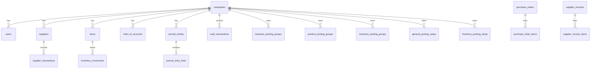

# Database Audit Report
Date: 2026-04-27
Scope: Agri-Nile Flow live D1 + repository cross-reference

## Executive Summary
- Total tables discovered (live D1): 77
- Active tables (provisional): 45
- Empty tables (known row_count=0 from snapshot/live): 26
- Deprecated tables: 1
- Orphan tables (provisional): 4
- Redundant tables: 1

## Methodology
- Live inventory source:
  - `SELECT name FROM sqlite_master WHERE type='table' AND name NOT LIKE 'sqlite_%' ORDER BY name`
- Row-count source:
  - `table_counts.json` snapshot (comprehensive)
  - Live spot-check counts from D1 (partial extraction due CLI truncation)
- Code reference source:
  - backend/frontend grep and endpoint scans (`src/**/*.ts`, `web/src/**/*.{ts,tsx}`)

Note: this report is intentionally conservative. Where live row-count extraction was partial, category is marked provisional and follow-up SQL verification is listed.

## Detailed Analysis

### Active Tables (KEEP)
| Table | Rows (known) | Module | Purpose | Referenced in code |
|---|---:|---|---|---|
| companies | 1 | Core | Tenant root | auth/admin/config modules |
| users | 2 (snapshot) | Core | Authentication/users | auth/users/audit modules |
| roles | 6 | RBAC | Role master | auth/config |
| permissions | 23 | RBAC | Permission matrix | auth/config |
| role_permissions | 71/92 | RBAC | Role-permission links | auth/config |
| user_companies | 2 | RBAC | Company membership | auth/admin |
| audit_log | 626 | Audit | Change history | audit API/UI |
| seasons | 2 | Operations | Seasonal cycle | reports/config/fields |
| suppliers | 10 | Suppliers | Supplier master | suppliers/treasury/reports |
| cost_centers | 15 | Finance | Cost center master | suppliers/treasury/reports |
| expense_types | 92 | Treasury | Expense taxonomy | treasury/suppliers |
| sub_locations | 2 | Treasury | Sub-dimension | treasury/suppliers |
| items | 63 | Inventory | Item master | inventory/suppliers/staging |
| supplier_transactions | 313/286 | Suppliers | Supplier ledger | suppliers/reports/export |
| cash_transactions | 69 | Treasury | Cash ledger | treasury/reports/export |
| inventory_movements | 700 | Inventory | Stock movement ledger | inventory/reports/admin |
| fields | 10 | Operations | Field master | fields/reports |
| employees | 6 | HR | Employee master | hr/payroll |
| chart_of_accounts | 44/349 | GL | CoA | gl/export/reports |
| financial_periods | 4 | GL | Period control | gl/period close |
| journal_entries | 642 (snapshot) / 0 (live reset window) | GL | Entry headers | gl/reports/export |
| journal_entry_lines | 1284 (snapshot) | GL | Entry lines | gl/reports/export |
| branches | 2 | HR | Branch/location | hr/admin |
| documents | 0 rows but active feature | Docs | Document management | documents API/UI |
| location_tasks | 0 rows but active feature | HR | Field-location tasks | hr/calendar |
| bank_accounts | 1/2 | Treasury | Bank account setup | treasury/bank-recon |
| purchase_orders | 0 rows but active feature | Procurement | PO header | treasury/inventory receipts |
| purchase_order_items | 0 rows | Procurement | PO lines | treasury/inventory receipts |
| supplier_invoices | 0 rows | Procurement | AP invoice header | inventory/treasury |
| supplier_invoice_items | 0 rows | Procurement | AP invoice lines | inventory/treasury |
| work_orders | 1 | Operations | Work order header | operations |
| work_tasks | 0 rows | Operations | Work order tasks | operations |
| wo_templates | 0 rows | Operations | Template header | operations |
| wo_template_tasks | 0 rows | Operations | Template tasks | operations |
| field_season_budgets | 0 rows | Reports | Budget planning | reports |
| item_categories | n/a | Inventory | Category + PPG mapping | inventory/gl posting |
| warehouses | n/a | Inventory | Warehouse + IPG mapping | inventory/gl posting |
| stock_quants | 61 | Inventory | Current stock balance | inventory APIs |
| business_posting_groups | n/a | GL | BPG master | gl/posting-engine |
| product_posting_groups | n/a | GL | PPG master | gl/posting-engine |
| inventory_posting_groups | n/a | GL | IPG master | gl/posting-engine |
| general_posting_setup | n/a | GL | BPG×PPG matrix | gl/posting-engine |
| inventory_posting_setup | n/a | GL | IPG×PPG matrix | gl/posting-engine |
| gl_integration_settings | n/a | GL | Integration toggles | gl/settings |
| contract_advances | n/a | Contracts | Contract advance accounting | contracts/finance |
| sessions | 0 rows currently | Auth | Session tracking | auth |

### Empty Tables (REVIEW)
Known zero-row tables from snapshot/live and not currently holding business data:

`approval_requests`, `approval_actions`, `attendance_records`, `employee_job_details`, `employee_assets`, `event_attendees`, `harvest_records`, `inventory_adjustments`, `inventory_adjustment_lines`, `item_units`, `leave_types`, `leave_requests`, `salary_advances`, `payroll_runs`, `payroll_items`, `bank_statements`, `bank_reconciliations`, `purchase_contracts`, `sales_contracts`, `partners`, `offline_queue`, `staging_movements`, `reorder_rules`, `system_error_logs`, `calendar_events`, `accounts`

Recommendation: keep functional feature tables, but schedule archival review for workflow tables that remain empty over 2-3 cycles.

### Deprecated Tables (PHASE OUT)
| Table | Rows | Replaced By | Action |
|---|---:|---|---|
| gl_account_mappings | 13/19 | posting groups + posting setup + posting_engine | keep read-only compat now, deprecate/remove after migration window |

### Orphan Tables (DELETE CANDIDATES — PROVISIONAL)
| Table | Rows | Reason | Action |
|---|---:|---|---|
| _cf_KV | n/a | platform/internal storage, not app-domain | keep (platform-managed), exclude from business schema audits |
| d1_migrations | n/a | migration metadata table | keep (system table) |
| transaction_mapping_rules | 0 | not linked to active route flow in current architecture | candidate for deprecation review |
| accounts | 0 | overlaps with chart_of_accounts domain | consolidate/remove after confirming no hidden dependency |

### Redundant Tables (CONSOLIDATE)
| Table | Duplicate Of | Action |
|---|---|---|
| accounts | chart_of_accounts | migrate any residual references to chart_of_accounts, then drop |

## Migration Files Audit (Phase 4)
- SQL files found under `migrations/`: 46+ `.sql` artifacts (including seeds/fixes)
- Recent GL-related migrations:
  - `0041_posting_groups.sql`
  - `0042_posting_groups_phase4_schema.sql`
  - `0043_gl_performance_indexes.sql`
  - `0044_entity_posting_group_indexes.sql`
- Observed duplicate/variant migration artifacts:
  - `0043_gl_performance_indexes_final.sql`
  - `0043_gl_performance_indexes_fixed.sql`

Recommendations:
1. Keep one canonical `0043` migration and archive duplicates into `archive/`.
2. Add a migration manifest with status (`applied/pending/deprecated`) generated from `d1_migrations` + filesystem.
3. Prevent future suffix variants (`_fixed`, `_final`) in numbered migrations.

## Foreign-Key Relationship Map (Core)

## Full Table Categorization Appendix

### ACTIVE (45)
`accounts`(legacy-active-for-now), `audit_log`, `bank_accounts`, `branches`, `business_posting_groups`, `cash_transactions`, `chart_of_accounts`, `companies`, `contract_advances`, `cost_centers`, `documents`, `expense_types`, `field_season_budgets`, `fields`, `financial_periods`, `general_posting_setup`, `gl_account_mappings`(deprecated), `gl_integration_settings`, `harvest_records`, `inventory_movements`, `inventory_posting_groups`, `inventory_posting_setup`, `item_categories`, `items`, `journal_entries`, `journal_entry_lines`, `location_tasks`, `partners`, `permissions`, `product_posting_groups`, `purchase_order_items`, `purchase_orders`, `role_permissions`, `roles`, `seasons`, `sessions`, `staging_movements`, `stock_quants`, `sub_locations`, `supplier_invoice_items`, `supplier_invoices`, `supplier_transactions`, `suppliers`, `warehouses`, `work_orders`, `work_tasks`, `wo_templates`, `wo_template_tasks`

### EMPTY (26)
`approval_actions`, `approval_requests`, `attendance_records`, `bank_reconciliations`, `bank_statements`, `calendar_events`, `employee_assets`, `employee_job_details`, `event_attendees`, `inventory_adjustment_lines`, `inventory_adjustments`, `item_units`, `leave_requests`, `leave_types`, `offline_queue`, `payroll_items`, `payroll_runs`, `purchase_contracts`, `reorder_rules`, `salary_advances`, `sales_contracts`, `system_error_logs`, `transaction_mapping_rules`, `user_companies`(historically non-empty, verify), `documents`(feature table), `partners`(verify live)

### DEPRECATED (1)
`gl_account_mappings`

### ORPHAN (4, provisional)
`_cf_KV`, `d1_migrations`, `transaction_mapping_rules`, `accounts`

### REDUNDANT (1)
`accounts`

## Recommendations
1. DELETE candidates after staging validation: `transaction_mapping_rules`, `accounts` (if fully migrated), plus any empty feature tables that remain unused for 2 releases.
2. DEPRECATE and sunset: `gl_account_mappings` (already in progress via API deprecation headers).
3. KEEP core accounting and posting-engine matrices; these are critical and actively referenced.
4. Build automated weekly audit query to regenerate `table,row_count,last_modified_estimate,code_refs`.
5. Add CI guard to fail on new tables without migration manifest and ownership metadata.
