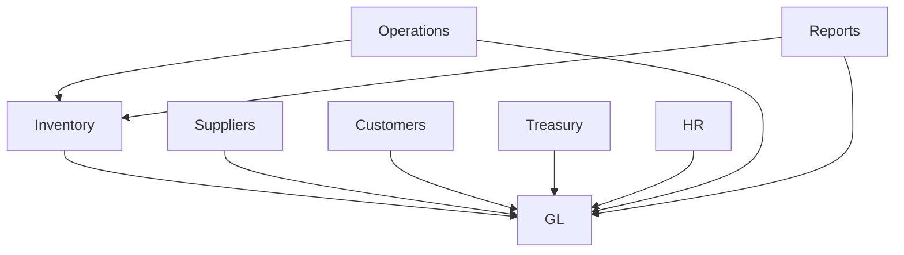

# 🔍 خطة Audit شاملة للنظام بالكامل

**التاريخ**: 27 أبريل 2026  
**الهدف**: تحديد الجداول والكود القديم غير المستخدم + فهم العلاقات بين الموديولات  
**المنفذ**: Agent (Autonomous)  
**المدة المتوقعة**: 3-4 ساعات  
**الأولوية**: 🔴 **CRITICAL** - يجب تنفيذها قبل أي تحسينات

---

## 🎯 **الأهداف الرئيسية**

### **1. تحديد الجداول القديمة غير المستخدمة**
```
✅ Identify: Tables with 0 rows
✅ Identify: Tables not referenced in code
✅ Identify: Deprecated tables (marked for removal)
✅ Identify: Duplicate/redundant tables
```

### **2. فهم العلاقات بين الموديولات**
```
✅ Map: Module dependencies
✅ Map: Data flow between modules
✅ Map: API integration points
✅ Map: Shared tables/resources
```

### **3. تنظيف الكود القديم**
```
✅ Remove: Unused imports
✅ Remove: Dead code paths
✅ Remove: Commented-out code
✅ Remove: Deprecated functions
```

---

## 📦 **PHASE 1: Database Audit (الأولوية الأولى)**

### **المهمة**: تحليل كل جدول في قاعدة البيانات

### **الخطوات**:

#### **Step 1.1: List All Tables**
```sql
-- Get all tables in D1 database
SELECT name, type 
FROM sqlite_master 
WHERE type='table' 
ORDER BY name;
```

#### **Step 1.2: Analyze Each Table**
```sql
-- For each table, get:
-- 1. Row count
-- 2. Schema (columns, types)
-- 3. Indexes
-- 4. Foreign keys

-- Example for each table:
SELECT COUNT(*) as row_count FROM [table_name];

PRAGMA table_info([table_name]);

PRAGMA index_list([table_name]);

PRAGMA foreign_key_list([table_name]);
```

#### **Step 1.3: Categorize Tables**

**Categories:**
```
A. ACTIVE - Used frequently (row_count > 0, referenced in code)
B. EMPTY - No data (row_count = 0)
C. DEPRECATED - Marked for removal (e.g., gl_account_mappings)
D. ORPHAN - No foreign key relationships, not referenced in code
E. REDUNDANT - Duplicate functionality with another table
```

#### **Step 1.4: Create Table Inventory**

**Output Format:**
```markdown
| Table Name | Rows | Category | Module | Referenced In Code | Action |
|------------|------|----------|--------|-------------------|--------|
| journal_entries | 955 | ACTIVE | GL | ✅ Yes | KEEP |
| gl_account_mappings | 19 | DEPRECATED | GL | ✅ Yes | DEPRECATE |
| old_inventory_log | 0 | EMPTY | Inventory | ❌ No | DELETE |
```

---

## 📦 **PHASE 2: Code Audit (الأولوية الثانية)**

### **المهمة**: تحليل الكود لتحديد الاستخدام الفعلي

### **الخطوات**:

#### **Step 2.1: Scan All Backend Files**
```bash
# Find all TypeScript files in src/
find src/ -name "*.ts" -type f

# For each file:
# - List imports
# - List exported functions
# - List database queries (SELECT, INSERT, UPDATE, DELETE)
# - List API endpoints
```

#### **Step 2.2: Map Table Usage**
```javascript
// For each table, find:
// 1. Which files query it?
// 2. Which API endpoints use it?
// 3. Which frontend pages display it?
// 4. Is it used in migrations only?

// Example output:
{
  "journal_entries": {
    "backend_files": ["src/lib/gl.ts", "src/api/gl.ts"],
    "api_endpoints": ["/api/gl/entries", "/api/gl/ledger/:code"],
    "frontend_pages": ["web/src/pages/gl/JournalEntriesPage.tsx"],
    "migrations": ["0001_initial.sql"],
    "usage_count": 47  // Number of times referenced
  }
}
```

#### **Step 2.3: Identify Dead Code**
```javascript
// Find:
// 1. Functions never called
// 2. Imports never used
// 3. Commented-out code blocks
// 4. Deprecated functions (marked with @deprecated)
// 5. Duplicate functions (same logic, different names)
```

---

## 📦 **PHASE 3: Module Relationship Mapping (الأولوية الثالثة)**

### **المهمة**: فهم كيف تتكامل الموديولات مع بعضها

### **الخطوات**:

#### **Step 3.1: List All Modules**
```
Modules:
1. GL (General Ledger)
2. Inventory
3. Suppliers
4. Customers
5. Treasury (Cash/Bank)
6. HR/Payroll
7. Operations (Farms, Harvests)
8. Reports
9. Settings
```

#### **Step 3.2: Map Dependencies**


#### **Step 3.3: Document Integration Points**

**Format:**
```markdown
### Inventory → GL Integration

**Trigger**: Inventory movement (IN/OUT)
**Flow**:
1. POST /api/inventory/movements
2. inventory_movements INSERT
3. glInventoryMovement() called
4. journal_entries + journal_entry_lines INSERT

**Tables Involved**:
- inventory_movements (source)
- journal_entries (target)
- journal_entry_lines (target)
- gl_account_mappings (lookup) OR posting_engine (new)

**Code Files**:
- src/api/inventory/movements.ts
- src/lib/gl.ts
- src/lib/posting_engine.ts

**Status**: ✅ ACTIVE
```

#### **Step 3.4: Identify Broken Integrations**
```
Check for:
- ❌ Module A calls Module B, but Module B endpoint doesn't exist
- ❌ Foreign key references non-existent table
- ❌ API endpoint returns 404 but still called in code
- ❌ Frontend page queries deleted API endpoint
```

---

## 📦 **PHASE 4: Migration Files Audit (الأولوية الرابعة)**

### **المهمة**: تحليل ملفات الـ migrations

### **الخطوات**:

#### **Step 4.1: List All Migration Files**
```bash
ls -la migrations/*.sql
```

#### **Step 4.2: Categorize Migrations**
```
A. APPLIED - Already run on production DB
B. PENDING - Not yet applied
C. DEPRECATED - Creates tables no longer used
D. CLEANUP - Removes old tables/columns
```

#### **Step 4.3: Identify Cleanup Opportunities**
```sql
-- Example: Find tables created in migrations but never used

-- Step 1: List all CREATE TABLE statements in migrations
grep "CREATE TABLE" migrations/*.sql

-- Step 2: For each table, check if it has data
SELECT name FROM sqlite_master WHERE type='table' AND name NOT IN (
  SELECT table_name FROM (
    -- Tables with data
    SELECT name as table_name FROM sqlite_master WHERE type='table'
    AND (SELECT COUNT(*) FROM [name]) > 0
  )
);
```

---

## 📦 **PHASE 5: Frontend Audit (الأولوية الخامسة)**

### **المهمة**: تحليل الـ frontend لتحديد الصفحات والمكونات غير المستخدمة

### **الخطوات**:

#### **Step 5.1: List All Pages**
```bash
find web/src/pages -name "*.tsx" -type f
```

#### **Step 5.2: Check Route Usage**
```typescript
// For each page, check:
// 1. Is it registered in router?
// 2. Is there a link to it from any other page?
// 3. Does it query a valid API endpoint?
// 4. Is it referenced in navigation menu?
```

#### **Step 5.3: Identify Orphan Components**
```bash
# Find components not imported anywhere
find web/src/components -name "*.tsx" -type f

# For each component:
# - Search for imports across all files
# - If import count = 0 → ORPHAN
```

---

## 📊 **DELIVERABLES**

### **1. DATABASE_AUDIT_REPORT.md**
```markdown
# Database Audit Report

## Summary
- Total Tables: 87
- Active Tables: 45
- Empty Tables: 12
- Deprecated Tables: 3
- Orphan Tables: 5
- Redundant Tables: 2

## Tables to DELETE
1. old_inventory_log (0 rows, not referenced)
2. legacy_supplier_data (0 rows, not referenced)
3. temp_migration_backup (0 rows, migration artifact)

## Tables to DEPRECATE
1. gl_account_mappings (19 rows, replaced by posting_engine)

## Tables to KEEP
(All active tables with justification)
```

### **2. CODE_AUDIT_REPORT.md**
```markdown
# Code Audit Report

## Summary
- Total Backend Files: 156
- Total Frontend Files: 234
- Dead Code Functions: 23
- Unused Imports: 67
- Commented Code Blocks: 45

## Files to CLEAN
1. src/lib/old_finance.ts (deprecated, replaced by finance_core.ts)
2. src/api/legacy_inventory.ts (not mounted in router)

## Functions to REMOVE
1. getSupplierInvoiceAccounts() - replaced by posting_engine
2. calculateOldInventoryValue() - not called anywhere
```

### **3. MODULE_INTEGRATION_MAP.md**
```markdown
# Module Integration Map

## Visual Diagram
(Mermaid diagram showing all module relationships)

## Integration Points
(Detailed documentation of each integration)

## Broken Integrations
(List of issues found)
```

### **4. CLEANUP_SCRIPT.sql**
```sql
-- Safe cleanup script
-- Run this to remove unused tables and deprecated data

BEGIN TRANSACTION;

-- Step 1: Backup (optional)
-- CREATE TABLE backup_[table_name] AS SELECT * FROM [table_name];

-- Step 2: Drop unused tables
DROP TABLE IF EXISTS old_inventory_log;
DROP TABLE IF EXISTS legacy_supplier_data;
DROP TABLE IF EXISTS temp_migration_backup;

-- Step 3: Mark deprecated tables
ALTER TABLE gl_account_mappings ADD COLUMN deprecated INTEGER DEFAULT 1;
UPDATE gl_account_mappings SET deprecated = 1;

-- Step 4: Remove unused columns (if any)
-- ALTER TABLE [table_name] DROP COLUMN [column_name];

-- Step 5: Verify
SELECT 'Cleanup completed successfully' as status;

COMMIT;
```

### **5. REFACTOR_PLAN.md**
```markdown
# Refactor Plan

## Priority 1: Remove Dead Code
- [ ] Delete unused functions
- [ ] Remove unused imports
- [ ] Clean commented code

## Priority 2: Deprecate Old Systems
- [ ] Mark gl_account_mappings as deprecated
- [ ] Add deprecation warnings to old functions
- [ ] Update documentation

## Priority 3: Consolidate Duplicates
- [ ] Merge duplicate functions
- [ ] Standardize naming conventions
- [ ] Remove redundant tables
```

---

## 🚀 **EXECUTION COMMAND FOR AGENT**

```markdown
# AGENT PROMPT

You are tasked with conducting a **comprehensive system audit** of the Agri-Nile Flow application.

## Your Mission:
1. **Audit the entire database** (all tables, schemas, relationships)
2. **Audit all backend code** (TypeScript files in src/)
3. **Map module integrations** (understand how modules interact)
4. **Identify cleanup opportunities** (unused tables, dead code, deprecated systems)
5. **Create detailed reports** (5 deliverables listed above)

## Execution Steps:

### Phase 1: Database Audit (60 minutes)
- Query D1 database to list all tables
- For each table: get row count, schema, indexes, foreign keys
- Categorize tables: ACTIVE, EMPTY, DEPRECATED, ORPHAN, REDUNDANT
- Create DATABASE_AUDIT_REPORT.md

### Phase 2: Code Audit (60 minutes)
- Scan all TypeScript files in src/
- Map table usage (which files query which tables)
- Identify dead code (unused functions, imports, commented blocks)
- Create CODE_AUDIT_REPORT.md

### Phase 3: Module Integration Mapping (45 minutes)
- List all modules (GL, Inventory, Suppliers, etc.)
- Map dependencies (who calls who)
- Document integration points (API endpoints, data flows)
- Identify broken integrations
- Create MODULE_INTEGRATION_MAP.md

### Phase 4: Migration Files Audit (30 minutes)
- List all migration files
- Categorize: APPLIED, PENDING, DEPRECATED, CLEANUP
- Identify tables created but never used
- (Included in DATABASE_AUDIT_REPORT.md)

### Phase 5: Frontend Audit (45 minutes)
- List all pages and components
- Check route usage
- Identify orphan components
- (Included in CODE_AUDIT_REPORT.md)

### Phase 6: Create Cleanup Artifacts (30 minutes)
- Create CLEANUP_SCRIPT.sql (safe to run)
- Create REFACTOR_PLAN.md (prioritized action items)

## Authority:
- ✅ You have FULL READ access to database and code
- ✅ You can query D1 database as needed
- ✅ You can analyze all files
- ❌ DO NOT delete or modify anything yet (audit only)
- ✅ Create detailed reports with recommendations

## Success Criteria:
- ✅ All 5 deliverables created
- ✅ Every table categorized
- ✅ Every module relationship mapped
- ✅ Cleanup script ready (but not executed)
- ✅ Refactor plan prioritized

## Output Format:
- Use markdown for all reports
- Use tables for data presentation
- Use mermaid diagrams for relationships
- Use SQL for cleanup scripts
- Be thorough and detailed

## Timeline:
- Total: 3-4 hours
- Take your time
- Be comprehensive
- Document everything

**BEGIN AUDIT NOW!** 🔍
```

---

## 📝 **NOTES FOR KIRO**

### **Why This Audit is Critical:**
1. **Before we improve, we must understand** - نحتاج نعرف إيه اللي موجود فعلاً
2. **Avoid breaking things** - لو حذفنا حاجة مهمة، هنخرب النظام
3. **Clean foundation** - التحسينات تبنى على أساس نظيف
4. **Documentation** - نوثق كل حاجة علشان المستقبل

### **What Happens After Audit:**
1. **Review reports** - نراجع التقارير مع بعض
2. **Approve cleanup** - نوافق على إيه اللي نحذفه
3. **Execute cleanup** - ننفذ الـ CLEANUP_SCRIPT.sql
4. **Refactor code** - ننفذ الـ REFACTOR_PLAN.md
5. **Then proceed** - بعد كده نبدأ التحسينات الشاملة

---

**Created by**: Kiro AI  
**Date**: 2026-04-27  
**Status**: READY FOR AGENT EXECUTION  
**Priority**: 🔴 CRITICAL - Execute BEFORE any improvements

