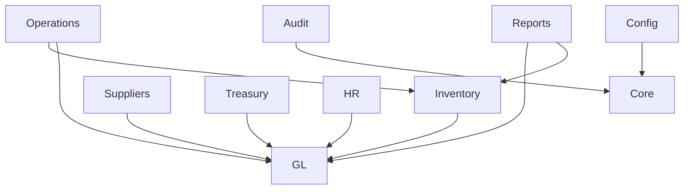

# Module Integration Map
Date: 2026-04-27

## Module Dependency Diagram

## Module Inventory
| Module | Key API Routes | Main Tables | Dependencies | Dependents |
|---|---|---|---|---|
| GL | `/api/gl/*` (largest route surface) | `chart_of_accounts`, `journal_entries`, `journal_entry_lines`, posting-group tables | auth, audit, posting_engine, finance_core | inventory, suppliers, treasury, hr, reports |
| Inventory | `/api/inventory/*` | `inventory_movements`, `items`, `warehouses`, `stock_quants` | GL via `FinanceCore` | reports, operations |
| Suppliers | `/api/suppliers/*` | `suppliers`, `supplier_transactions`, invoice tables | GL via `FinanceCore` | reports, treasury |
| Treasury | `/api/treasury/*` | `cash_transactions`, `bank_accounts`, reconciliation tables | GL (`FinanceCore` + some direct posting) | reports |
| HR/Payroll | `/api/hr/*`, `/api/employees/*` | `employees`, payroll/attendance tables | GL for payroll postings | reports/admin |
| Operations | `/api/operations/*`, fields/harvest | `work_orders`, `work_tasks`, `fields`, `harvest_records` | inventory + GL | reports |
| Reports | `/api/reports/*` + GL report endpoints | read-heavy on GL + ops tables | all domain modules | dashboard/users |
| Settings/Config | `/api/config/*`, `/api/admin/*` | users/roles/permissions/company tables | core auth | all modules |
| Audit | `/api/audit/*` | `audit_log`, `system_error_logs` | auth RBAC | admin/accounting oversight |

## Integration Points

### Inventory -> GL
- Trigger: inventory movement create/post (IN/OUT)
- Flow:
  1. Inventory API validates transaction
  2. Writes source movement rows
  3. Calls `FinanceCore.resolveInventoryMovement`
  4. Posting engine resolves matrix (IPG×PPG)
  5. Journal rows inserted in GL
- Tables:
  - source: `inventory_movements`
  - lookup: `inventory_posting_setup`, `general_posting_setup`, posting groups
  - target: `journal_entries`, `journal_entry_lines`
- Status: ACTIVE

### Suppliers -> GL
- Trigger: supplier invoice/payment posting
- Flow:
  1. Supplier/treasury APIs assemble business context
  2. `FinanceCore.resolveSupplierInvoice` or `resolveSupplierPayment`
  3. Posting engine resolves BPG×PPG and AP/cash accounts
  4. Journal entry posted
- Tables:
  - source: `supplier_transactions`, `supplier_invoices`, `supplier_invoice_items`
  - lookup: posting setup + supplier/item groups
  - target: `journal_entries`, `journal_entry_lines`
- Status: ACTIVE

### Treasury -> GL
- Trigger: cash movement posting and selected treasury operations
- Flow:
  1. Cash transaction created
  2. Posting through `FinanceCore.postCashMovement` (preferred) or direct `postAutoEntry` in some legacy branches
  3. Journal posting into GL
- Tables:
  - source: `cash_transactions`
  - target: `journal_entries`, `journal_entry_lines`
- Status: ACTIVE (standardization needed)

### HR/Payroll -> GL
- Trigger: payroll run posting / wage payment events
- Flow:
  1. Payroll aggregates built
  2. GL posting function invoked (partly legacy utility exports remain)
  3. Journal generated
- Tables:
  - source: `payroll_runs`, `payroll_items`, `employees`
  - target: `journal_entries`, `journal_entry_lines`
- Status: PARTIAL (data tables currently mostly empty in snapshot)

### Reports -> Domain Modules
- Trigger: user opens report pages
- Flow: read-only aggregate queries across GL, suppliers, treasury, inventory, operations
- Status: ACTIVE

## Module-to-Module Call Evidence (Representative)
- `src/api/inventory/movements.ts` -> `FinanceCore.resolveInventoryMovement`
- `src/api/inventory/receipts.ts` -> `FinanceCore.processPOReceipt`
- `src/api/suppliers.ts` -> `FinanceCore.resolveExpensePosting` / `resolveSupplierPayment`
- `src/api/treasury.ts` -> `FinanceCore.recordCashMovement` / `postCashMovement`
- `src/api/gl.ts` -> posting_engine resolvers + setup/health/validation APIs

## Broken or Risky Integrations
| From | To | Issue | Fix |
|---|---|---|---|
| Treasury | GL | mixed posting path (`FinanceCore` + direct `postAutoEntry`) | enforce single posting boundary in route conventions |
| Legacy GL mappings | Posting engine | compatibility surface still present | keep sunset headers; remove after migration cutoff |
| Migration set | Runtime schema | multiple 0043 variants in migrations folder | keep one canonical migration and archive duplicates |

## Recommendations
1. Enforce one integration contract: all accounting side-effects must enter via `FinanceCore`.
2. Remove direct posting utilities from route layers once standardized.
3. Keep posting setup health checks as deployment gate.
4. Add integration tests per cross-module flow (Inventory->GL, Suppliers->GL, Treasury->GL, Payroll->GL).
5. Generate dependency graph automatically in CI to catch accidental coupling drift.
